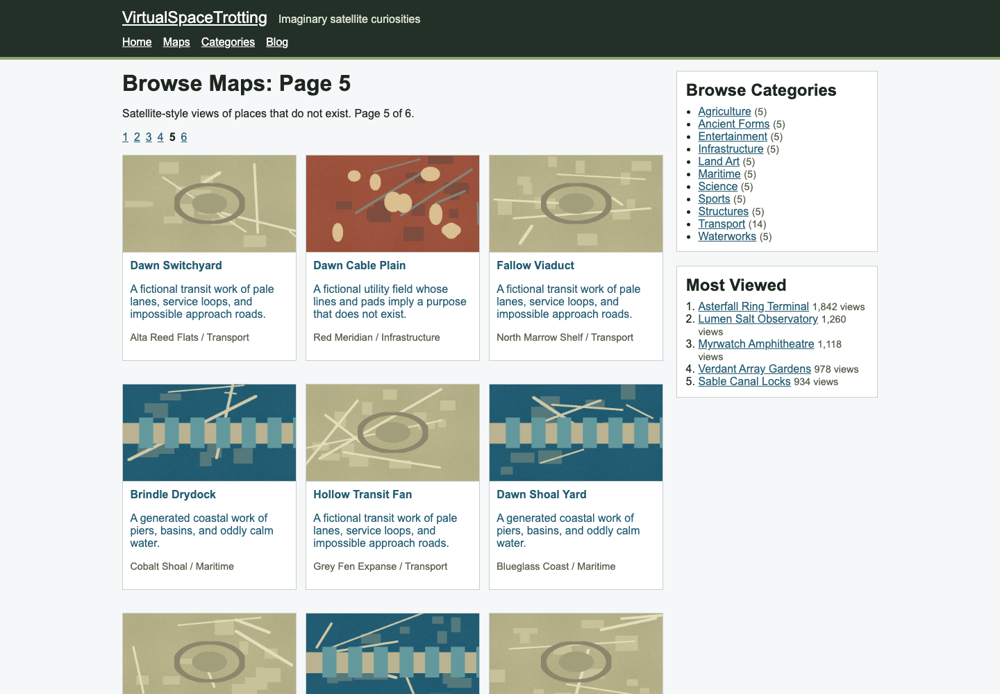

# VirtualSpaceTrotting



VirtualSpaceTrotting exists first as a realistic test site for Akamai mPulse Boomerang real user monitoring. The fictional atlas gives Boomerang enough page depth, navigation variety, generated imagery, and static asset weight to exercise browse, category, detail, and content-heavy page views without relying on a production customer site.

The public browsing structure is a deep fictional atlas: map/category browsing, popular and latest lists, location detail pages, and lightweight editorial context. Every location, image, and place description in this project must be fictional and clearly treated as generated content.

The page template already contains the origin-side Akamai mPulse Boomerang snippet. Setup only needs a Linode access token and this site's Boomerang API key.

References:

- [Akamai mPulse origin setup](https://techdocs.akamai.com/mpulse/docs/set-up-behavior-options)
- [Akamai Boomerang implementation guide](https://techdocs.akamai.com/mpulse-boomerang/docs/implementation)
- [Akamai mPulse key concepts](https://techdocs.akamai.com/mpulse/docs/key-concepts-terms)

## Setup And Deploy

The intended setup path is deliberately small:

1. Clone the repository.

   ```bash
   git clone https://github.com/atomless/VirtualSpaceTrotting.git
   cd VirtualSpaceTrotting
   ```

2. Add the local setup values.

   ```bash
   cp .env.example .env.local
   $EDITOR .env.local
   chmod 600 .env.local
   ```

   Fill in `LINODE_TOKEN`. Add `BOOMERANG_API_KEY` when the mPulse app exists.

   ```bash
   LINODE_TOKEN=paste-your-linode-token-here
   BOOMERANG_API_KEY=optional-paste-your-mpulse-boomerang-api-key-here
   ```

   `.env.local` is gitignored. Do not commit it.

3. Create the Akamai mPulse Boomerang app and get this site's API key when you are ready to collect mPulse data.

   - Make sure your Akamai account has mPulse App Administrator privileges.
   - Log in to mPulse.
   - Choose `New > App`.
   - Select `HTML5` for this static multi-page site.
   - Enter the deployed site domain or public URL.
   - Open the app's `General` tab and enable `Show JavaScript` next to the API key.
   - Copy the generated mPulse API key into `BOOMERANG_API_KEY`.

   Akamai's mPulse API key is a public page instrumentation key, not a REST API secret. It identifies this site's beacons and is expected to appear in the page HTML.

4. Tell your coding agent to set up the remote and deploy the site.

   Use this exact instruction:

   > Run the project setup, create or update the Linode remote named `prod`, deploy the current committed `main` branch, and verify the public `/health` endpoint and a paginated maps page. If `BOOMERANG_API_KEY` is present in `.env.local`, also verify the Boomerang script request and an mPulse beacon.

   The agent should run the project helper:

   ```bash
   make deploy-linode-one-shot DEPLOY_LINODE_ARGS="--remote-name prod --region gb-lon --profile small"
   ```

   After the first deploy, updates use:

   ```bash
   make remote-update
   ```

Release bundles are built from committed `HEAD`. Commit and push the work you want deployed before asking the agent to deploy or update the remote.

## Boomerang Snippet

VirtualSpaceTrotting should use origin-side mPulse tagging because the current launch target is a Linode-hosted Spin site. Place the Boomerang snippet in the document `<head>` after position-sensitive metadata and before the app's main scripts, matching Akamai's placement guidance.

The committed page template already contains this pattern:

```html
<script>
  window.BOOMR_live = 1;
  window.BOOMR_config = {
    Errors: { monitorReporting: true, monitorRejections: true },
    LOGN: { storeConfig: true },
    Continuity: { afterOnload: true, afterOnloadMaxLength: false }
  };
  window.BOOMR_API_key = "XXXXX-XXXXX-XXXXX-XXXXX-XXXXX";
</script>
<script>
  // Loads https://c.go-mpulse.net/boomerang/XXXXX-XXXXX-XXXXX-XXXXX-XXXXX.
</script>
```

`BOOMERANG_API_KEY` is substituted at build time when present. Without it, the committed snippet stays inert and deployments still proceed.

## Current Status

The repository has been initialized with:

- project governance tailored to this repository,
- lean Linode setup and remote-update helper patterns,
- test coverage for the helper layer,
- Makefile targets for setup, verification, and remote operations.
- a SvelteKit static site with semantic browsing routes,
- deterministic fictional preview imagery and provenance metadata,
- a Rust Spin health component and static-file serving manifest,
- a first-run Linode deploy helper that installs Spin as a systemd service.

## Local Commands

```bash
make setup
make test
make test-code-quality
make build
```

Linode host setup and day-2 operations:

```bash
make deploy-linode-one-shot DEPLOY_LINODE_ARGS="--remote-name prod --region gb-lon --profile small"
make remote-use REMOTE=prod
make remote-status
make remote-update
```

`make deploy-linode-one-shot` and `make remote-update` ship committed `HEAD`; uncommitted changes are not included in the release bundle.

## Content Notes

The current launch seed is 64 fictional locations across 11 categories. The map index paginates at 12 locations per page, and category pages paginate once a category has enough depth. Images are procedural generated previews so the site can be built and reviewed without extra API credentials.

## Deployment Notes

The first-run Linode helper needs `LINODE_TOKEN` in `.env.local` and creates or attaches a host. `BOOMERANG_API_KEY` is optional for deployment and enables mPulse instrumentation when present. By default the helper serves the Spin app publicly on port `3000`; pass `--public-base-url` when pointing a domain or reverse proxy at the service.
